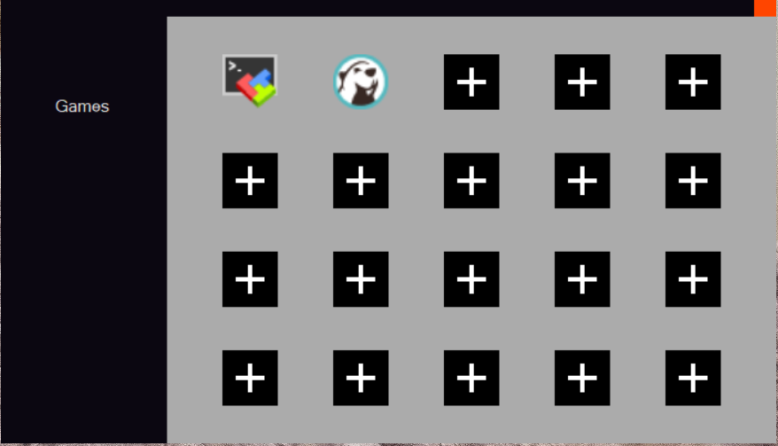

# dldydgns-Archive

주요 프로젝트 Top5

<table>
  <thead>
    <tr>
      <th style="text-align:center; width:30px;">NO</th>
      <th style="text-align:center; width:120px;">프로젝트명</th>
      <th style="text-align:center; width:calc(100% - 330px);">이미지</th>
      <th style="text-align:left; width:120px">주요내용</th>
      <th style="text-align:center; width:60px;">링크</th>
    </tr>
  </thead>
  <tbody>
    <tr>
      <td style="text-align:center;">1</td>
      <td style="text-align:center;">MyController</td>
      <td style="text-align:center;"></td>
      <td style="text-align:left;">
        Elgato사의 스트림덱이라는 모델을 구매하려다 비싸서 직접 만든 소프트웨어입니다.
      </td>
      <td style="text-align:center;">
        <a href="https://github.com/dldydgns/MyController">링크</a>
      </td>
    </tr>
    <tr>
      <td style="text-align:center;">2</td>
      <td style="text-align:center;"></td>
      <td style="text-align:center;"></td>
      <td style="text-align:left;"></td>
      <td style="text-align:center;"></td>
    </tr>
    <tr>
      <td style="text-align:center;">3</td>
      <td style="text-align:center;"></td>
      <td style="text-align:center;"></td>
      <td style="text-align:left;"></td>
      <td style="text-align:center;"></td>
    </tr>
    <tr>
      <td style="text-align:center;">4</td>
      <td style="text-align:center;"></td>
      <td style="text-align:center;"></td>
      <td style="text-align:left;"></td>
      <td style="text-align:center;"></td>
    </tr>
    <tr>
      <td style="text-align:center;">5</td>
      <td style="text-align:center;"></td>
      <td style="text-align:center;"></td>
      <td style="text-align:left;"></td>
      <td style="text-align:center;"></td>
    </tr>
  </tbody>
</table>

